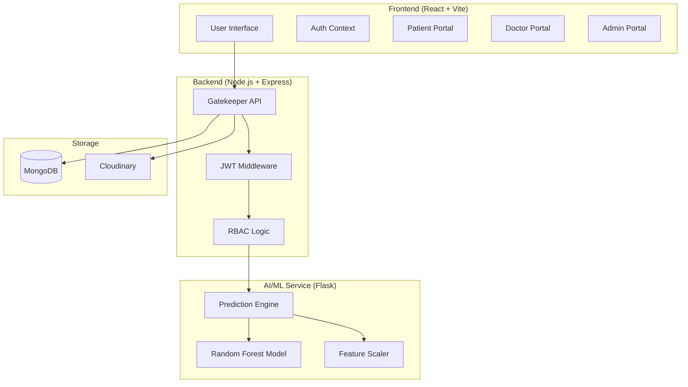

# 🏥 Aarogya Mitra: e-Healthcare Management System

[](https://mongodb.com)
[](https://scikit-learn.org)
[](https://www.docker.com/)
[](https://opensource.org/licenses/MIT)

Aarogya Mitra is a production-grade e-Healthcare Management System designed to bridge the gap between patients and healthcare providers. It features a robust MERN stack architecture integrated with a specialized Flask-based Machine Learning service for real-time disease prediction.

---

## 🏗️ System Architecture



---

## 🌟 Core Features

### 👤 Patient Experience
- **Smart Onboarding:** JWT-secured registration and profile customization.
- **Appointment Lifecycle:** Browse specialists, book slots, and track real-time status.
- **Digital Health Record:** Secure PDF/Image medical report management via Cloudinary.
- **AI Health Check:** Instant heart disease risk assessment powered by ML.

### 🩺 Professional Doctor Suite
- **Dynamic Dashboard:** Comprehensive view of upcoming and past consultations.
- **Clinical Governance:** Review patient history, manage appointments, and log consultation notes.
- **Workflow Efficiency:** One-click status updates for patient queue management.

### 🛡️ Administrative Control
- **Holistic Monitoring:** System-wide analytics for patients, doctors, and appointments.
- **User Governance:** Detailed oversight of all platform participants and activities.

---

## 🤖 Machine Learning Excellence

The platform integrates a sophisticated **Heart Disease Prediction** model:
- **Accuracy:** 92% (Validated on clinical datasets).
- **Algorithm:** Optimized Random Forest Classifier.
- **Features:** 13 key clinical parameters (Age, BP, Cholesterol, etc.).
- **Response:** Instant classification with risk level (Low/Medium/High).

---

## 🛠️ Technology Stack

| Layer | Technologies |
| :--- | :--- |
| **Frontend** | React 18, Vite, Tailwind CSS, Lucide Icons, Axios, Zod |
| **Backend** | Node.js, Express.js, MongoDB, Mongoose, JWT, Multer |
| **AI Service** | Python 3.12, Flask, Scikit-Learn, Pandas, Joblib |
| **Infrastructure** | Docker, Docker Compose, Cloudinary |

---

## 🚀 Quick Start

### Prerequisites
- Node.js v18+
- Python 3.10+
- MongoDB (Local or Atlas)
- Cloudinary Credentials

### Installation

1.  **Clone & Install:**
    ```bash
    git clone https://github.com/your-repo/aarogya-mitra.git
    cd aarogya-mitra
    npm install # Root dependencies (if any)
    ```

2.  **Infrastructure (Docker Alternative):**
    ```bash
    docker-compose up --build
    ```

3.  **Local Development:**
    | Service | Directory | Command |
    | :--- | :--- | :--- |
    | **Backend** | `./backend` | `npm run dev` |
    | **Frontend** | `./frontend` | `npm run dev` |
    | **ML Service** | `./ml-service` | `python app.py` |

---

## 📁 Repository Structure

- [**`backend/`**](file:///d:/resume/resume%20projects/aarogya-mitra/backend/README.md): Node.js API server & business logic.
- [**`frontend/`**](file:///d:/resume/resume%20projects/aarogya-mitra/frontend/README.md): React SPA with Tailwind styling.
- [**`ml-service/`**](file:///d:/resume/resume%20projects/aarogya-mitra/ml-service/README.md): Flask API for AI predictions.
- **`docker-compose.yml`**: Full system orchestration.

---

## 🔐 Security & Technical Excellence
- **Authentication:** Stateless JWT with HttpOnly cookie support.
- **Validation:** Strict schema enforcement using Zod on both ends.
- **Security:** Bcrypt hashing, Protected Routes, and CORS management.
- **Scalability:** Microservice-inspired separation of concerns.

---

## 📄 License
This project is licensed under the MIT License.

---
Created as a high-impact Portfolio Project.
