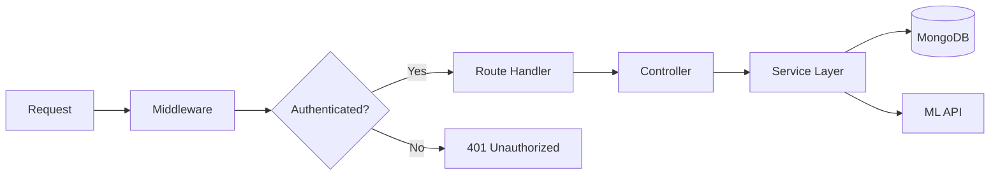

# ⚙️ Aarogya Mitra - Backend API

This is the core business logic layer of the Aarogya Mitra ecosystem, built with **Node.js** and **Express.js**.

## 🚀 Key Features
- **JWT Authentication:** Secure user sessions using JSON Web Tokens.
- **Role-Based Access Control (RBAC):** Distinct permissions for Patients, Doctors, and Admins.
- **Medical Report Management:** Automated upload and storage logic using **Cloudinary**.
- **Schema Validation:** Robust data integrity using **Zod**.
- **Database Integration:** ODM modeling with **Mongoose** for MongoDB.

## 🛠️ Architecture

## 📂 Structure
- `config/`: Database and Cloudinary settings.
- `models/`: Mongoose schemas for Users, Appointments, and Predictions.
- `routes/`: API endpoint definitions.
- `middleware/`: Auth and Error handling filters.
- `validators/`: Zod schemas for input validation.

## 🚦 Local Setup
1. `cd backend`
2. `npm install`
3. Configure `.env` (use `.env.example` as reference)
4. `npm run dev`

> **Note**: For a full-system launch (Backend + Frontend + ML), use the **`start-app.bat`** orchestrator in the project root.
